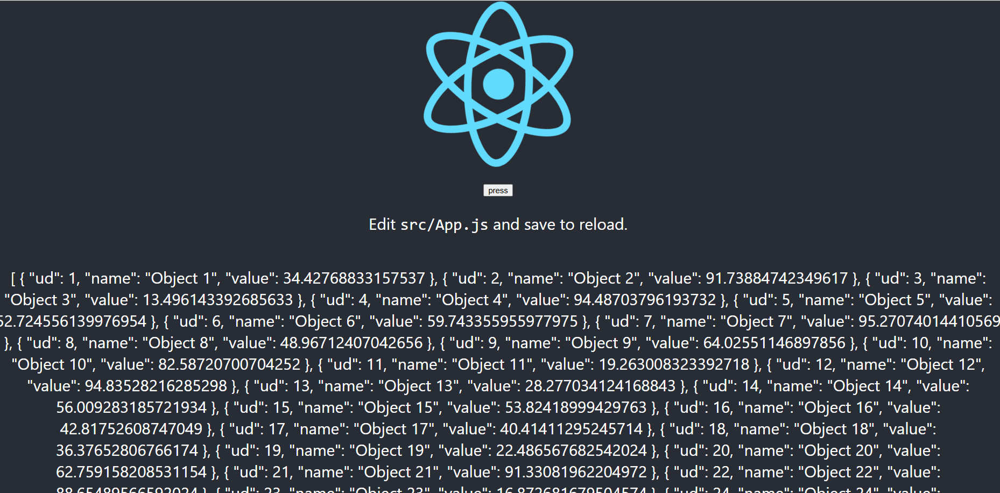
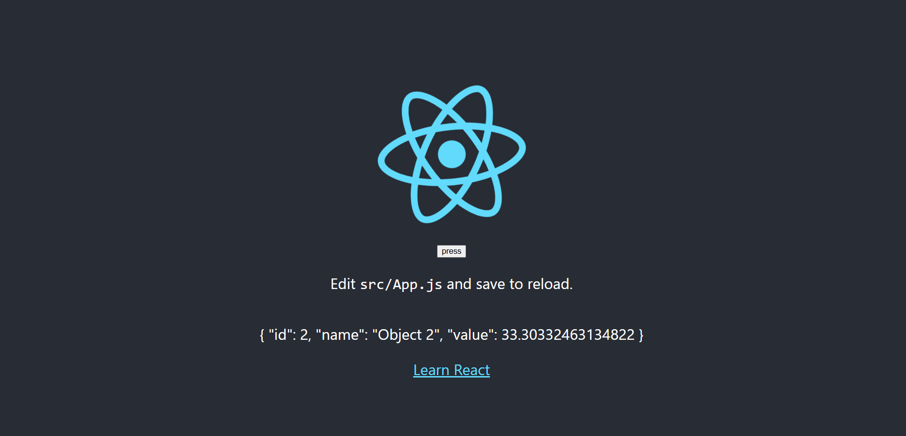
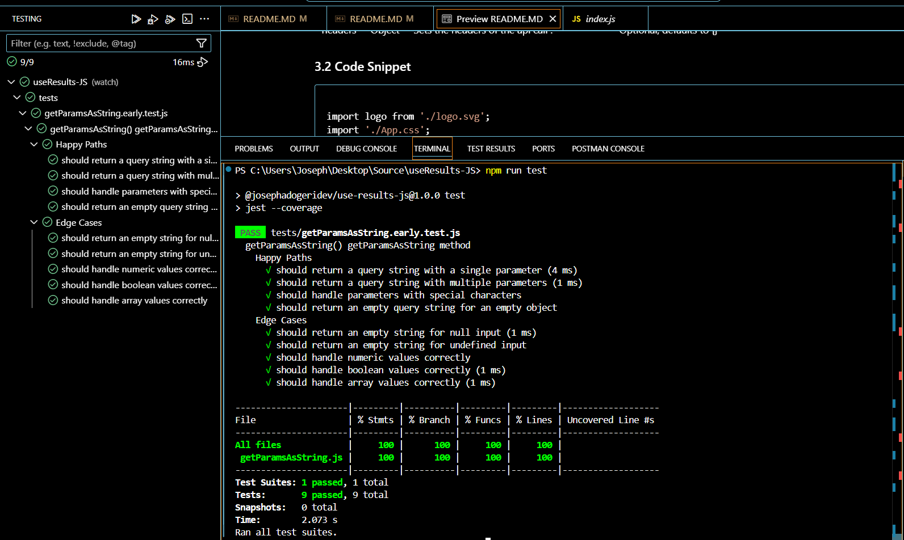
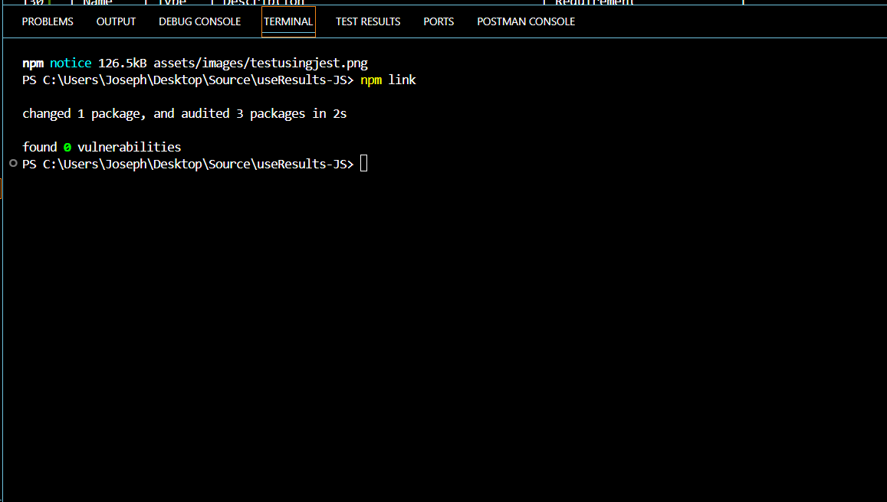
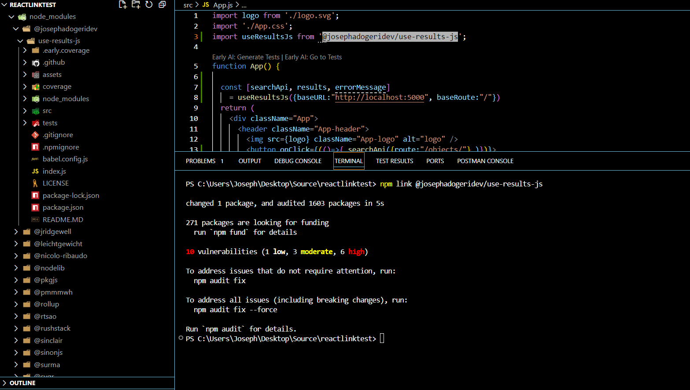
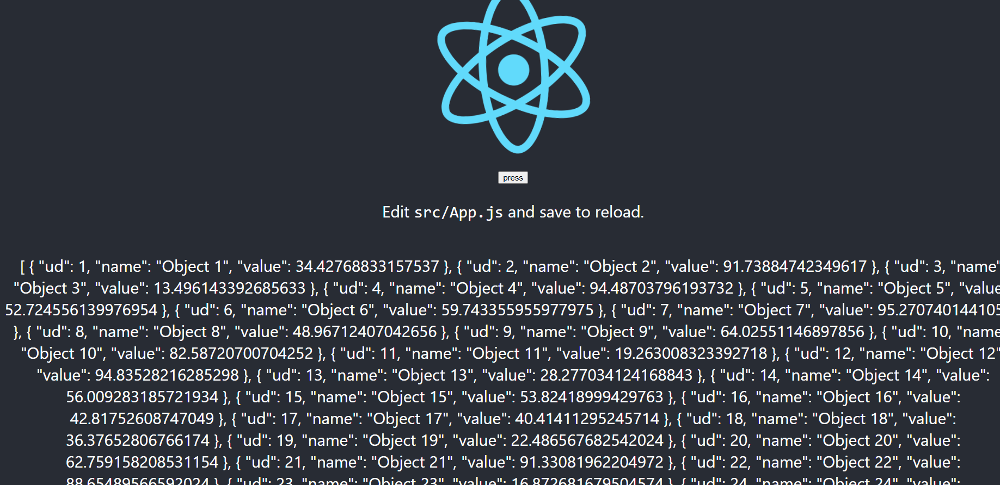
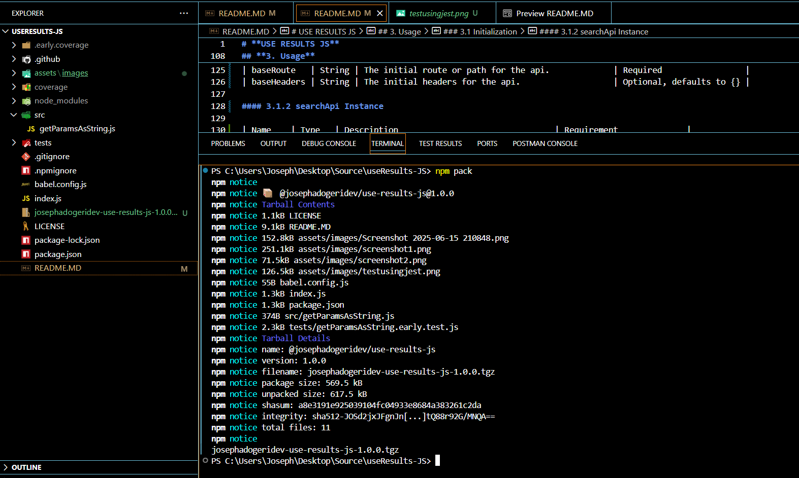
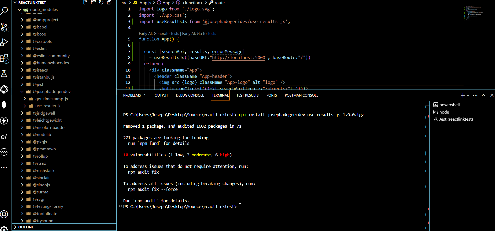

# **GET TIMESTAMP JS**

**Version:** 1.0.0
**Date:** June 7, 2025

---

## Description

This is a javascript npm package for creating timestamp in readable format.

## Authors

[@jadogeri](https://www.github.com/jadogeri)

## Repository

 [https://github.com/jadogeri/GetTimeStampJS.git](https://github.com/jadogeri/GetTimeStampJS.git)

## Registory

[https://www.npmjs.com/package/@josephadogeridev/get-timestamp-js](https://www.npmjs.com/package/@josephadogeridev/get-timestamp-js)

## Screenshots

|  |  |
| -------------------------------------------- | -------------------------------------------- |
|                                              |                                              |

## Table of Contents

<ul>
      <li><a href="#1-introduction">1. Introduction</a>
        <ul>
          <li><a href="#11-purpose">1.1 Purpose</a> </li>
          <li><a href="#12-scope">1.2 Scope</a> </li>
          <li><a href="#13-intended-audience">1.3 Intended Audience</a> </li>
        </ul>
      </li>
    </ul>
    <ul>
      <li><a href="#2-technology-stack">2. Technology Stack</a>
      </li>
    </ul>
    <ul>
        <li><a href="#3-usage">3. Usage</a> </li>
        <ul>
            <li><a href="#31-install-dependency">3.1 Install Dependency</a> </li>
            <li><a href="#32-code-snippet">3.2 Code Snippet</a> </li>
        </ul>
    </ul> 
    <ul>
        <li><a href="#4-tests">4. Tests</a> </li>
        <ul>
            <li><a href="#41-test-from-node_modules">4.1 Test from node_modules</a> </li>
            <li><a href="#42-test-using-npm-link">4.2 Test using npm link</a> </li>
            <li><a href="#43-test-using-npm-pack">4.3 Test using npm pack</a> </li>
        </ul>
    </ul> 
    <ul>  
        <li><a href="#5-license">5. License</a>
        </li>
    </ul> 
    <ul> 
        <li><a href="#6-references">6. References</a>
        </li>
    <ul>

## **1. Introduction**

### **1.1 Purpose**

This document outlines the package architecture, components, and design considerations for Get TimeStamp JS package. The goal is to create a timestamp in readable format.

### **1.2 Scope**

This package will allow users to:

- Create timestamp as string.
- Resolve undefined and null values as inputs.
- Render results of timestamp after test.

### **1.3 Intended Audience**

- Junior or Senior developers.
- Beginners learning javascript.

---

### **2. Technology Stack**

- **Programming Languages**: Javascript
- **IDE**: Visual Studio Code (VSCode)
- **Test**: Jest
- **Plugins**: Early AI
- **Registory**: NPM (Node Package Manager)
- **Source Control**: Git and GitHub
- **CI/CD**: GitHub Actions
- **Code Analysis**: SonarQube

---

## **3. Usage**

### 3.1 Install Dependency

1 Type npm install @josephadogeridev/get-timestamp-js to install dependencies.

```bash
  npm install @josephadogeridev/get-timestamp-js
```

### 3.2 Code Snippet

```ruby

import logo from "./logo.svg";
import "./App.css";
import { getTimeStamp } from "@josephadogeridev/get-timestamp-js";
export function App() {
  const time = getTimeStamp();
  return (
    <div className="App">
        <header className="App-header">
            <div>      
                <h1>{time}</h1>
            </div>
            
        </header>
    </div>
  )
}

```

## 4. Tests

#### **4.1 Test from node_modules**

note : run test from node_modules after `<a href="#3-usage">` Usage`</a>`

1 Navigate to cd @josephadogeridev/get-timestamp-js directory using command below.

```bash
  cd node_modules/@josephadogeridev/get-timestamp-js
```

2 Type npm run test to run unit tests.

```bash
  npm run test
```



#### **4.2 Test using NPM Link**

Note : this test was done pre publish to npm manager

1 In the root of package run npm link to create symbolic link  between a local package under development and another Node.js project that wants to use it as a dependency.

```bash
  npm link
```



2 Create or use existing React Application.

3 Run command npm link @josephadogeridev/get-timestamp-js to install created package.

```bash
  npm link @josephadogeridev/get-timestamp-js
```



```ruby

import logo from './logo.svg';
import './App.css';
import { getTimeStamp } from "@josephadogeridev/get-timestamp-js";


function App() {
    const time = getTimeStamp();

  return (
    <div className="App">
      <header className="App-header">
        <h1>{time}</h1>
        
        <p>
          Edit <code>src/App.js</code> and save to reload.
        </p>
        <a
          className="App-link"
          href="https://reactjs.org"
          target="_blank"
          rel="noopener noreferrer"
        >
          Learn React
        </a>
      </header>
    </div>
  );
}

export default App;

```

##### Example



#### **4.3 Test using NPM Pack**

Note : this test was done pre publish to npm manager

1 In the root of package run npm pack to package the module into a zipped file (.tgz).

```bash
  npm pack
```



2 Create or use existing React Application.

3 Copy and paste the created file in the root of a React Application.

4 Run command npm install @josephadogeridev/get-timestamp-js to install created package.

```bash
  npm install @josephadogeridev/get-timestamp-js
```



## **5. License**

[LICENSE](/LICENSE)

---

## **6. References**

* FreeCodeCamp : [Frontend Web Development: (HTML, CSS, JavaScript, TypeScript, React)](https://www.youtube.com/watch?v=MsnQ5uepIa).
* AweSome Open Source : [Awesome Readme Templates](https://awesomeopensource.com/project/elangosundar/awesome-README-templates)
* Readme.so : [The easiest way to create a README](https://readme.so/)
* Mockingoose : [How to test mongoose models with jest and mockingoose](https://dev.to/darkmavis1980/how-to-test-mongoose-models-with-jest-and-mockingoose-2k10)
* NPM : [Creating nodejs modules](https://docs.npmjs.com/creating-node-js-modules)
* Dev.io : [Testing npm packages before publishing](https://dev.to/vcarl/testing-npm-packages-before-publishing-h7o)
* FreeCodeCamp : [How to create and publish an NPM Package - step by step guide](https://www.freecodecamp.org/news/how-to-create-and-publish-your-first-npm-package/)
* Dev.io : [Create and Publish NPM Package for custom Hooks in React JS](https://dev.to/shivampawar/create-and-publish-npm-package-for-custom-hooks-in-react-js-5237)
